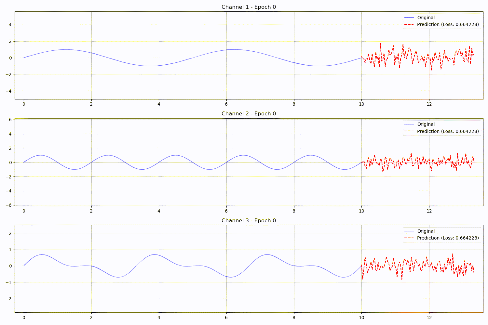
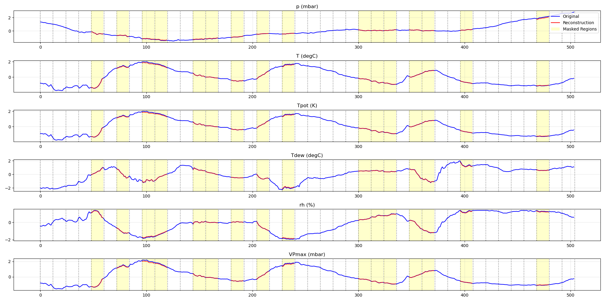
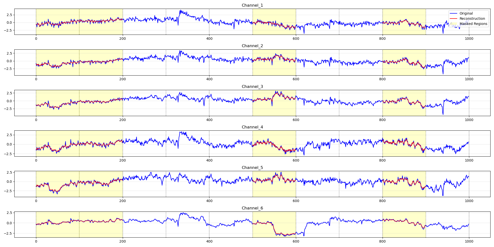

# minPatchTST

This project is an independent validation of PatchTST (A Time Series is Worth 64 Words: Long-term Forecasting with Transformers). It reuses the model code from the [original GitHub implementation](https://github.com/yuqinie98/PatchTST) to support additional SSL investigations.

## Installation

Clone this repository and install the required dependencies:

```bash
git clone https://github.com/TachyonGun/minPatchTST.git
cd minPatchTST
pip install wandb twdm matplotlib numpy torch
```

## Quickstart



To quickly validate the model's capability, run the overfitting test:

```bash
python tests/test_overfit.py
```

This script generates synthetic time series data with clear patterns (sine waves) and demonstrates the model's ability to learn and predict these patterns. The test creates visualizations in `test_results/` showing how the model learns to predict future values.


# Pretraining on Custom, Paper and SEED IV Datasets


**IMPORTANT:** If you don't have Weights and Biases, turn off logging by setting `USE_WANDB = False` in `pretrain.py`.

You can modify the `DATASET` variable in `pretrain.py` to choose from any of these datasets:

- **⭐Your dataset⭐** (See Below)
- SEED IV  (See below)
- ETT-small (PatchTST paper, see below)
- electricity (")
- traffic (")
- weather (")


## Using Custom Datasets

The project now supports any time series dataset stored as numpy arrays with a simple folder structure. Just organize your data as follows:

```
 my_dataset/
    ├── train.npy      # Required: shape (samples, channels, timesteps) or (channels, timesteps)
    ├── validation.npy # Optional!!!: same shape structure as train
    └── test.npy      # Optional!!!: same shape structure as train
```

The shape can be, for example:
 - "10 samples of 1000 time steps for 16 channels" (10, 16, 1000), 
 - a "10000 time steps for 16 channels" if you want to use it as one contiguous array.

The data loader will automatically:
- Use memory mapping for efficient loading
- Handle both 2D (channels, timesteps) and 3D (segments, channels, timesteps) arrays
- Load validation and test sets if available
- Create appropriate data loaders for the PatchTST model

You can also use alternative folder structures by modifying the dataset name to some `my/dataset/path`. For example, you can point to the SEED IV folder `seed_iv/session` constructed with the instructions in the next section:

```python
# Load from a different directory
loaders = create_dataloader('seed_iv/session/', ...)

# The SEED dataset structure the code below creates
seed_iv/
└── session/
    ├── train.npy
    ├── validation.npy
    └── test.npy
```

To pretrain, simply edit the `DATASET` variable of `pretrain.py` to `my/dataset/path` and run
   ```bash
   python pretrain.py
   ```

*This makes it easy to use the PatchTST model with any time series data without modifying the codebase*. Just save your preprocessed data in the expected format and start training!

Note: The data should be preprocessed and normalized before saving as .npy files. The model expects numerical time series data where each channel represents a different feature or measurement over time and *that's it*, it's completelty generic.


## PatchTST Paper datasets

*Weather dataset reconstructions*

To pretrain on one of the datasets used in the original paper:

1. Download the dataset files from <https://drive.google.com/drive/folders/1ZOYpTUa82_jCcxIdTmyr0LXQfvaM9vIy>
2. Extract the downloaded `all_six_datasets.zip` file in the project root. This should create an `all_six_datasets` folder containing the folders with CSV files for each dataset (electricity, ETT-small, exchange_rate, illness, traffic, weather)
3. Run the preprocessing script to convert the CSV files to numpy arrays and extract column names:
   ```bash
   python make_six_datasets.py
   ```
   This will create `.npy` files and corresponding `_columns.txt` files for each dataset in the `all_six_datasets` folder.
4. You can now modify the `DATASET` variable in `pretrain.py` to choose `all_six_datasets/{dataset_name}` where `dataset_name` can be `electricity`, `ETT-small`, `exchange_rate`, `illness`, `traffic`, `weather`.
   Run the pretraining script with your chosen dataset:
      ```bash
      python pretrain.py
      ```

## Setting up the SEED Dataset



*Seed IV subsample reconstructions after just 2 epochs*

1. Download [SEED-IV subsample off Kaggle](https://www.kaggle.com/datasets/phhasian0710/seed-iv)

2. Place your SEED-IV dataset folder in the root directory with the following structure:
```
.
├── seed_iv/
│   ├── eeg_raw_data/
│   │   ├── 1/
│   │   │   ├── 1_20160518.mat
│   │   │   ├── 1_20160518_blink.mat
│   │   │   └── ...
│   │   ├── 2/
│   │   └── ...
│   └── emotion_labels/
│       ├── 1_20160518.mat
│       └── ...
```

3. Run the preprocessing script (needs ~40GB RAM):
```bash
python make_seed.py
```

This will create the processed dataset in the following structure:
```
.
├── seed_iv/
│   ├── session/
│   │   ├── train.npy  # Training data
│   │   ├── val.npy    # Validation data
│   │   └── test.npy   # Test data
│   └── ... (original data folders)
```

The processed .npy files will contain the EEG data in the format expected by the model. The output of the script should look like:

```
Final shapes:
Train data: (1597, 62, 10000), labels: (1597,)
Validation data: (427, 62, 10000), labels: (427,)
Test data: (428, 62, 10000), labels: (428,)

Saving arrays...

Training label distribution:
Label 0: 435 samples (27.2%)
Label 1: 467 samples (29.2%)
Label 2: 432 samples (27.1%)
Label 3: 263 samples (16.5%)

Validation label distribution:
Label 0: 113 samples (26.5%)
Label 1: 125 samples (29.3%)
Label 2: 81 samples (19.0%)
Label 3: 108 samples (25.3%)

Test label distribution:
Label 0: 127 samples (29.7%)
Label 1: 115 samples (26.9%)
Label 2: 84 samples (19.6%)
Label 3: 102 samples (23.8%)
```

To pretrain, simply edit the `DATASET` variable of `pretrain.py` to your new `seed_iv/session/` and run
   ```bash
   python pretrain.py
   ```

## TODO

- Validate with downstream evaluations
- Support for TUH data loading


